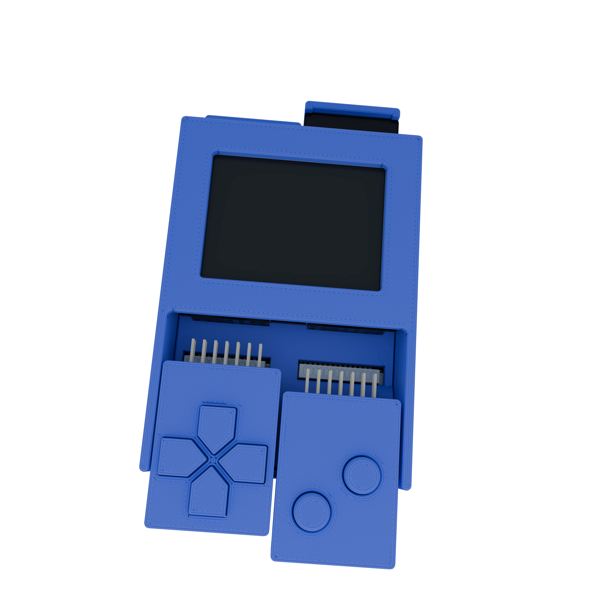

<h1 align="center">
    Hackxpansion
</h1>

<h4 align="center">
    A handheld with 4 expansion solts
</h4>

    

## Key Features

- Resistor based module idnetification at start up
- [2" 240x320 ST7789 LCD panel](https://www.buydisplay.com/2-inch-ips-tft-lcd-display-ips-panel-screen-240x320-for-smart-watch)
- RP2354 MCU
- Easily adaptable module standard
- Rust firmware with [embassy](https://embassy.dev/) and [slint-ui](https://slint.dev/)
